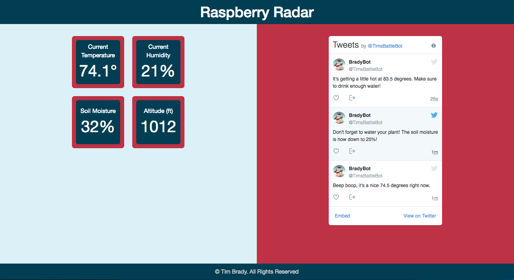

# Raspberry Radar

Raspberry Radar is an internet of things project that captures the temperature, humidity, soil moisture, and altitude and serves up a webpage to display the information. It also utilizes the Twitter API to notify me of when certain thresholds are met, like needing to water my plant.

## Author

**Tim Brady** - [tfb414](https://github.com/tfb414)

## Software

* JavaScript ES5
* jQuery 3.2.1
* HTML5/CSS3
* Twitter API
* Websocket
* Python
* Linux

## Hardware

* Raspberry Pi
* DMT22
* SEN-13637

## Getting Started

I begin building this project early along in my software development journey. I currently do not have this running live, but I am working on rebuilding this in react which I will then host permanently.

### 1. Concept

I love the connection of software to real work and tangible technology. Raspberry Pi was something that I was toying with prior to my software development bootcamp. It was an easy way for me to dip my toes in. A weather station seemed like and easy and cool project to get started on. 

### 2. Initial Planning

I began by connecting via SSH to my raspberry pi. Once I figured that out I quickly wrote a program to access the sensors that I had connected. Once I understood the sensor documentation it was relatively simply to get a response back from the sensors. 

### 3. Creating a server and a webpage

Using Node I was able to create a website to display the information that I had recieved from my sensors. Once that was done, I setup a twitter account and wrote some logic on when my bot should be tweeting at me.

### 4. Future Additions

If we had more time, we would...

* Rewrite it using React
* Totaly redo the user interface
* Better logic on what and when to tweet
* Capture and hold more data for historical purposes

## Closing Thoughts
This has been a fun project to play around with, but I think that a lot of the architecture and the code is very sloppy. I learned a lot and I'm excited to rewrite this using react. 

## Acknowledgments

Thank you to my instructor at DigitalCrafts!
* **Chris Aquino** - [radishmouse](https://github.com/radishmouse)
